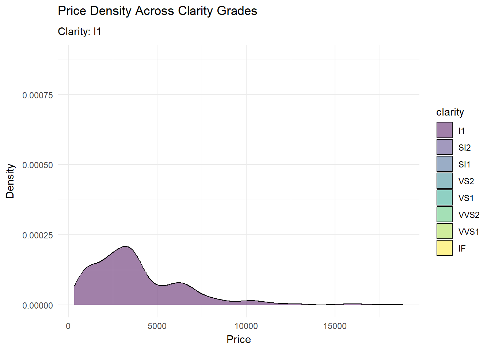

## Introduction

The diamonds dataset, included in R's ggplot2 package, is a widely used dataset for practicing data visualization and analysis.
 - Objective: To uncover patterns, distributions, and relationships among diamond attributes using visualizations.
 - Key Questions:
-What are the distributions of key variables like price and carat?
-How do attributes like cut, clarity, and color influence price?
-Are there patterns or correlations between variables like carat and price?

## Description of Variables

-price:Numeric; the price of the diamond in US dollars.
-carat:Numeric; weight of the diamond (1 carat = 200 mg).
-cut:Categorical; quality of the diamond's cut: Fair, Good, Very Good, Premium, Ideal.
-clarity:Categorical; internal purity: IF, VVS1, VVS2, VS1, VS2, SI1, SI2, I1.
-color:Categorical; color grade: D (Colorless) to J (Noticeable Color).


``` r
library(ggplot2)
library(tidyverse)
```

```
## ── Attaching core tidyverse packages ──────────────────────── tidyverse 2.0.0 ──
## ✔ dplyr     1.1.4     ✔ readr     2.1.5
## ✔ forcats   1.0.0     ✔ stringr   1.5.1
## ✔ lubridate 1.9.3     ✔ tibble    3.2.1
## ✔ purrr     1.0.2     ✔ tidyr     1.3.1
## ── Conflicts ────────────────────────────────────────── tidyverse_conflicts() ──
## ✖ dplyr::filter() masks stats::filter()
## ✖ dplyr::lag()    masks stats::lag()
## ℹ Use the conflicted package (<http://conflicted.r-lib.org/>) to force all conflicts to become errors
```

``` r
library(dplyr)
```
## Exploratory Data Analysis (EDA)
# Univariate Analysis

**Price Distribution**
-Visualization: Histogram.
-Insight: Identifies price range and skewness.


``` r
ggplot(diamonds, aes(x = price)) +
  geom_histogram(binwidth = 500, fill = "blue", color = "black") +
  labs(title = "Distribution of Diamond Prices", x = "Price", y = "Count")
```

}}index_files/figure-html/unnamed-chunk-2-1.png" width="672" />

**Carat Distribution**

- Visualization: Boxplot.
- Insight: Highlights common carat sizes and outliers.


``` r
ggplot(diamonds, aes(y = carat)) +
  geom_boxplot(fill = "lightgreen", color = "black") +
  labs(title = "Boxplot of Carat", y = "Carat")
```

}}index_files/figure-html/unnamed-chunk-3-1.png" width="672" />

**Cut Quality Distribution**

- Visualization: Bar chart.
- Insight: Shows the frequency of different cut categories.


``` r
ggplot(diamonds, aes(x = cut)) +
  geom_bar(fill = "purple", color = "black") +
  labs(title = "Count of Diamonds by Cut", x = "Cut", y = "Count")
```

}}index_files/figure-html/unnamed-chunk-4-1.png" width="672" />

**BIVARIATE ANALYSIS**

**Carat vs. Price**

- Visualization: Scatter plot.
- Insight: Examines the relationship between carat size and price.


``` r
ggplot(diamonds, aes(x = carat, y = price)) +
  geom_point(alpha = 0.3, color = "darkblue") +
  labs(title = "Scatter Plot of Carat vs. Price", x = "Carat", y = "Price")
```

}}index_files/figure-html/unnamed-chunk-5-1.png" width="672" />
**Price by Cut**

- Visualization: Boxplot.
- Insight: Compares price ranges across cut categories.


``` r
ggplot(diamonds, aes(x = cut, y = price)) +
  geom_boxplot(fill = "orange", color = "black") +
  labs(title = "Price Distribution by Cut", x = "Cut", y = "Price")
```

}}index_files/figure-html/unnamed-chunk-6-1.png" width="672" />

**Price by Clarity**

- Visualization: Violin plot.
- Insight: Shows the distribution of price for each clarity grade.


``` r
ggplot(diamonds, aes(x = clarity, y = price)) +
  geom_violin(fill = "cyan", color = "black") +
  labs(title = "Price Distribution by Clarity", x = "Clarity", y = "Price")
```

}}index_files/figure-html/unnamed-chunk-7-1.png" width="672" />
**MULTIVARIATE ANALYSIS**

**Carat vs. Price by Clarity**

- Visualization: Scatter plot with clarity as color.
- Insight: Explores how clarity influences the carat-price relationship.

``` r
ggplot(diamonds, aes(x = carat, y = price, color = clarity)) +
  geom_point(alpha = 0.5) +
  labs(title = "Carat vs. Price by Clarity", x = "Carat", y = "Price")
```

}}index_files/figure-html/unnamed-chunk-8-1.png" width="672" />

**Carat vs. Price by Cut**

- Visualization: Faceted scatter plot.
- Insight: Examines variations in the carat-price relationship across cuts.


``` r
ggplot(diamonds, aes(x = carat, y = price)) +
  geom_point(alpha = 0.8, color = "grey") +
  facet_wrap(~cut) +
  labs(title = "Carat vs. Price Faceted by Cut", x = "Carat", y = "Price")
```

}}index_files/figure-html/unnamed-chunk-9-1.png" width="672" />
**Price Density Plot**
- Visualization: Density plot.
- Insight: Highlights peaks and smooth distribution of prices.


``` r
options(scipen = 1000)
ggplot(diamonds, aes(x = price)) +
  geom_density(fill = "lightblue", alpha = 0.5) +
  labs(title = "Density Plot of Prices", x = "Price", y = "Density")
```

}}index_files/figure-html/unnamed-chunk-10-1.png" width="672" />
## Using transition_time (from gganimate package)
This is useful when visualizing how a variable changes over time or sequentially through categories. Although the diamonds dataset doesn’t include a time variable, you can create sequences based on categorical or numeric variables for animation.

*Animate Price Distribution by Cut or Clarity*
Animate how the price distribution evolves for different cut or clarity categories.

``` r
library(gganimate)
```

```
## Warning: package 'gganimate' was built under R version 4.4.2
```

``` r
ggplot(diamonds, aes(x = price)) +
  geom_histogram(binwidth = 500, fill = "skyblue", color = "black") +
  labs(title = "Price Distribution by Cut", x = "Price", y = "Count") +
  transition_states(cut, transition_length = 2, state_length = 1) +
  labs(subtitle = "Cut: {closest_state}")
```

<!-- -->

*Animate Carat vs. Price by Clarity*
Show how the carat-price relationship changes for different clarity grades.


``` r
ggplot(diamonds, aes(x = carat, y = price, color = clarity)) +
  geom_point(alpha = 0.5) +
  labs(title = "Carat vs. Price by Clarity", x = "Carat", y = "Price") +
  transition_states(clarity, transition_length = 2, state_length = 1) +
  labs(subtitle = "Clarity: {closest_state}")
```

<!-- -->

## Using patchwork (from patchwork package)
-Side-by-Side Comparison of Univariate Distributions
Combine histograms of price and carat distributions.

``` r
library(patchwork)
```

```
## Warning: package 'patchwork' was built under R version 4.4.2
```

``` r
plot_price <- ggplot(diamonds, aes(x = price)) +
  geom_histogram(binwidth = 500, fill = "blue") +
  labs(title = "Price Distribution", x = "Price", y = "Count")

plot_carat <- ggplot(diamonds, aes(x = carat)) +
  geom_histogram(binwidth = 0.1, fill = "green") +
  labs(title = "Carat Distribution", x = "Carat", y = "Count")

plot_price + plot_carat
```

}}index_files/figure-html/unnamed-chunk-13-1.png" width="672" />

#Comparing Relationships Across Variables
Place scatter plots of carat vs. price faceted by cut and clarity together for better comparison.

``` r
plot_cut <- ggplot(diamonds, aes(x = carat, y = price)) +
  geom_point(alpha = 0.3, color = "red") +
  facet_wrap(~cut) +
  labs(title = "Carat vs. Price by Cut", x = "Carat", y = "Price")

plot_clarity <- ggplot(diamonds, aes(x = carat, y = price)) +
  geom_point(alpha = 0.3, color = "blue") +
  facet_wrap(~clarity) +
  labs(title = "Carat vs. Price by Clarity", x = "Carat", y = "Price")

plot_cut | plot_clarity
```

}}index_files/figure-html/unnamed-chunk-14-1.png" width="672" />
Animate Price Density Plot by Clarity

``` r
ggplot(diamonds, aes(x = price, fill = clarity)) +
  geom_density(alpha = 0.5) +
  labs(title = "Price Density Across Clarity Grades",
       x = "Price", y = "Density",
       subtitle = "Clarity: {closest_state}") +
  transition_states(clarity, transition_length = 2, state_length = 1) +
  theme_minimal()
```

<!-- -->

## Conclusion

Visualizations provide a clear understanding of the diamonds dataset, revealing key trends and relationships.
